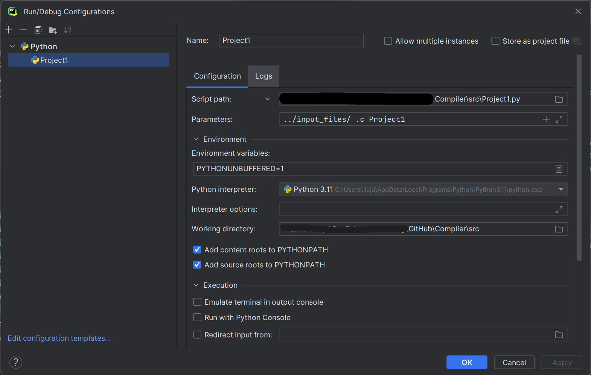

# Compiler
In this project we will create a compiler from scratch. The compiler we are programming, 
is a compiler for c. This compiler will be made in Python.

This project is made for the course Compilers at the University of Antwerp.

### Table Of contents
1. [ Assignments. ](#assign)
2. [ Testing. ](#testing)
3. [ Files. ](#dir)
4. [ Sources. ](#sources)
5. [ Authors. ](#authors)

### Assignments

#### Project 1
    - Installing Antlr
    - Constructing the grammar
    - Dot format visualisation

#### Project 2
    - Expanding the grammar with variables

#### Project 3
    - Adding comments "//" and multiline comments "/**/"
    - Convert C -> LLVM

### How to test?
Guide on how to test our Compiler, the guide is meant for Pycharm users.

Check if the following path is set right. You could do this by running it on Pycharm, or Terminal, or by script.
If you do it in the terminal, match the parameters option of pycharm with the parameters in the Terminal.
#### Jetbrains Pycharm
</img>

#### on Terminal
    Eg.: Python3 Project1.py ../input_files/ .c Project1

If you want to run this for Project 2, don't change the py file, only change the c file. 
    
#### Script
    

### Files
    Grammar: ../Grammars/Math.g4
    Python scripts: ../src/
    C Files: ../input_files/
    The output of the scripts: ../Output/

### Sources
[ https://github.com/antlr/antlr4/blob/master/doc/getting-started.md ](#Antlr) --- Antlr installation  
[ https://graphviz.org/doc/info/lang.html ](#Dot_language) --- Dot language   
[ https://llvm.org/ ](#LLVM) --- LLVM  
[ https://llvm.org/docs/LangRef.html ](#LLVM refernce page) --- LLVM ref. page

### Authors
    Jason.Liu@student.uantwerpen.be - Jason L. Student nr.: 20213082
    Orfeo.Terkuçi@student.uantwerpen.be - Orfeo T. Student nr.: 20213863

 
